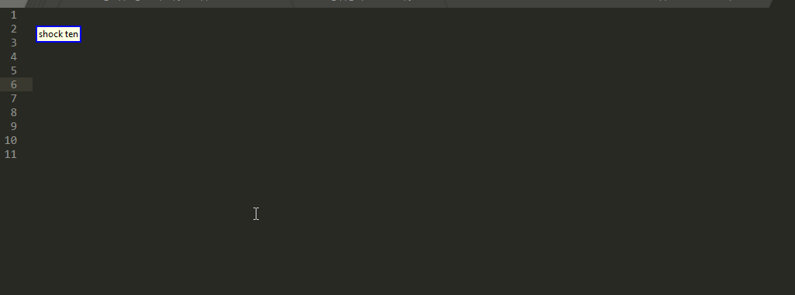
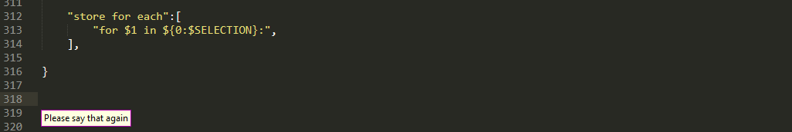
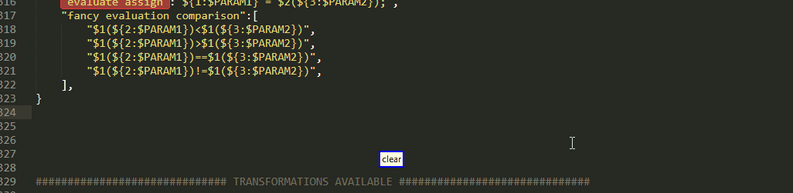
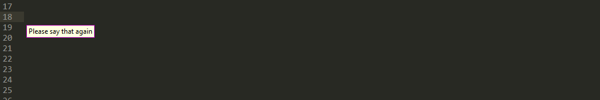

# CasterSublimeSnippetInterfaceExample

Repository for experimenting with sublime snippets and Caster voice commands 

## Contents
<!-- MarkdownTOC  autolink="true" -->

- [Introduction And Motivation](#introduction-and-motivation)
- [First Example](#first-example)
	- [Basic Usage](#basic-usage)
	- [Snippets With Variants Initial](#snippets-with-variants-initial)
- [Custom C++ Snippets](#custom-c-snippets)
	- [Snippets With Variants Improved](#snippets-with-variants-improved)
- [More Experimental Features](#more-experimental-features)
	- [Applying Transformations To Snippets](#applying-transformations-to-snippets)
		- [Potential Improvements](#potential-improvements)
	- [Passing Parameters To Snippets](#passing-parameters-to-snippets)
		- [General About Snippet Parameters](#general-about-snippet-parameters)
		- [Primitive And Fake Auto Complete Like Functionality](#primitive-and-fake-auto-complete-like-functionality)
		- [Collecting Those Parameters](#collecting-those-parameters)
		- [Improvements - Intuitively Named Variables](#improvements---intuitively-named-variables)
- [Snippets Generated From C++ STL](#snippets-generated-from-c-stl)

<!-- /MarkdownTOC -->

## Introduction And Motivation

When programming by voice, utilizing code snippets can have an important impact on improving your speed and making your overall experience more enjoyable! Nonetheless, creating such snippets can be time-consuming, because you need to create all the individual .sublime-snippet files containing the actual content of those snippets as well as the voice grammar containing commands to trigger them!

This is a proof of concept that lifts these restriction and which I hope will make your life easier by enabling you to do everything from only the grammar side!

None of the following, and I mean literally NONE (including the quick panel!), requires any additional code running on the sublime side and in fact not even a single .sublime-snippet file! Everything can be directly edited from within the grammar which uses the sublime command line interface `subl` to insert custom (possibly even dynamically generated) snippets!

But enough blah blah let's get going!

## First Example

Let's start with the [original example](./sublime_snippet_example.py) 

### Basic Usage

As they say, a gif is worth a thousand words


(please note that the file has been modified ever since these gif was recorded but you still get the point)


### Snippets With Variants Initial


I have also added some support for snippets with variants, so that you can use suffix integer

```python
"<snippet_variants> [<n>]"
```

to select which alternative from an 1-indexed list of variants of the same snippet you want! In case of error, you can use 

```python
"variant <n>"
```

To pick another variant and you can optionally display those alternatives on the quick panel by using

```python
"display variants"
```

To see that all in action


## Custom C++ Snippets

Inside [custom_cpp.py](./custom_cpp.py) you can find a whole bunch of custom snippets that I have created for my personal usage. You probably might want to change them to suit your needs but they could serve as a baseline, I really had a great time with some of them like `error line [<n>]`!


### Snippets With Variants Improved

This script would take those ideas a bit further and has 2 formats for snippets with variants

* the old 1-indexed list of strings

* a callable which will be fed with the choice `n`, if not provided the default value will be 1

```python
{
    "attribute assign":
        lambda n: "".join(["auto& $"+x+" = $1.$"+x+";\n" for x in string_range(2,n + 2)]),

    "error line":lambda n:"std::cerr<< " + ' << " " << '.join(["$" + str(x) for x in range(1,n + 1)]) + " << std::endl;",
    "error named":lambda n:"std::cerr<< " + ' << " " << '.join(['"${0}" << " " << ${0}'.format(x) for x in range(1,n + 1)]) + " << std::endl;",

    "output attributes":lambda n:"${0:std::cout}<< " + ' << " " << '.join(["$1.$" + str(x) for x in range(2,n + 2)]) + " << std::endl;",
}
```



As you can see, the `variant <n>` command also works with them! 


## More Experimental Features

Inside [custom_cpp_experimental.py](./custom_cpp_experimental.py) you will find more or less the same snippets but with a couple of more features. How useful they actually are and what changes should be made is yet to be determined!

### Applying Transformations To Snippets

A feature that might be of interest is the ability to apply some transformation upon the last snippet inserted. 

```python
"apply <transformation>":
	R(Key("c-z") + Function(transform_last_snippet)),
```

this script currently supports

- callable with a single argument

- tuple if you want to use a regular expression

In the latter case, the tuples should contain anything that you would pass into `re.sub` excluding third parameter which would be the string you apply the substitution on. You can find implementation [here](https://github.com/mpourmpoulis/CasterSublimeSnippetInterfaceExample/blob/master/custom_cpp_experimental.py#L70) for more details!


But on top of that you can also pass in a list of transformations and they will be applied one after another!


#### Potential Improvements

One of the examples above shows two successive commands that apply transformation, with the second being fed the result of the first one! it might make sense to keep a stack so that if we do not like some sequence of transformation we could revert as many steps as we want, or even have a command like

```python
"instead apply <transformation>":
	R(Key("c-z") + Function(transform_last_snippet_instead)),
```

To revert to the last transformation and apply another one instead in a single go

### Passing Parameters To Snippets

Now this is something kinda interesting but it remains to be seen if it is really worth the trouble

#### General About Snippet Parameters

Except from the more classical placeholders, sublime also  allows the usage of [environmental variables](https://sublime-text-unofficial-documentation.readthedocs.io/en/latest/extensibility/snippets.html#snippet-features) in snippets. For instance, using `$SELECTION` we can perform something somewhat similar to Caster's Store And Retrieve functionality



But what we are mostly interested in are the ones we can supply to the command ourselves `$PARAM1,$PARAM2,...,$PARAMn`!
we simply need to pass them to the `insert_snippet` command as arguments along with the snippet contents. 

```python
snippet_parameters = {"PARAM{0}".format(i+1):s for i,s in enumerate(stored_values)}
snippet_parameters["PARAMn"] = ",".join(stored_values)
snippet_parameters["contents"] = snippet
send_sublime("insert_snippet",snippet_parameters)
```

At this point it should be noted that we can use other names as well!


#### Primitive And Fake Auto Complete Like Functionality

The core idea is is that we can

* Collect words, phrases and so on but we want to reuse later

* Specifying snippets where we want each of them to appear using `$PARAM1` and so on

* Specify whether these values should be used or not. Currently if you want to use them you just need the suffix `over`

```python
        "<snippet> over":
            R(Function(insert_snippet_with_defaults)),
        "<snippet_variants> [<n>] over":
            R(Function(insert_snippet_with_variants_and_defaults)),

```

For instance, 




And by making `$PARAMn` have a special meaning like all the other values concatenated with the `,` in between 

```python
"loop zip":"for(auto&& $1 : zip(${2:$PARAMn})){\n\t$0\n}\n",
```

We can achieve something like




What is being currently implemented is of course very primitive and the values are immediately consumed, but whatever:)

#### Collecting Those Parameters

initially I wanted to be able to insert a snippet  and when I'm done with a field to grab it all  and store it before moving on, but so far I have not been able to find a way to do this consistently. so what is currently available is simply selecting the current word and then store and what ever is selected using the clipboard

```python
        "jerry":
            R(Function(store_and_next)),
```

After doing so, this command will advance to the next snippet field as well, but we can have commands the do not!

Currently these values are simply pushed into a stack but we could use a suffix index to specify which slot we want to fill instead like

```python
        "jerry [<n>]":
            R(Function(store_and_next)),
```

But there is another improvement we can make in the plot

#### Improvements - Intuitively Named Variables

Because as it seems we can use other names as well, we could define variables with more intuitive names such as `$ITERABLE` for staff we iterate over in  for loops and the commands that would look like `(jerry|what ever command name you like) iterable`.  Then the value stored by this command can only be used by a snippet that wants an `$ITERABLE` and vice versa! this might be interesting but I couldn't guarantee but it would make too much of a difference!


## Snippets Generated From C++ STL

These are some snippets I have generated from  the C++ STL signatures I retrieved from [cppreference](https://en.cppreference.com/w/) in these are in fact what I was working on when I found all of this is possible. 

You can retrieve them under [voice_cpp.py](./voice_cpp.py)


Now there are a lot of limitations

- Currently only algorithms are covered

- all of this was made in a bit of a hurry, so no care has been taken to support variants or split standards!

- this scripts I used need rewriting,there are a few trailing `,` here and there

- To be done properly and cover this sheer size of C++ STL, these needs to be done within a self modifying rule so that you can selectively activate only what you need

- But even then there are design decisions over what we want to include in the grammar!

- They are adapted do what I needed 

- As it is kinda old, most of the features she above are missing:)

So as you can see there is a lot of things that are kinda broken but I would say for the most part they do the job at least the way I needed them to:) I will eventually make a separate repository for them and get them done properly, but for now integrating snippets with Caster is a higher priority! 

Also make sure that the paths to the json files are correct!!!!!