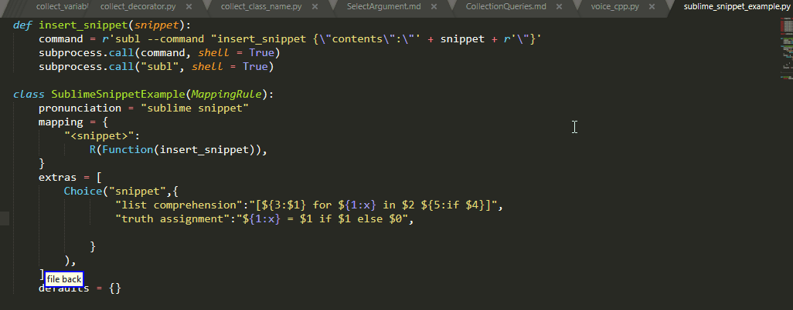
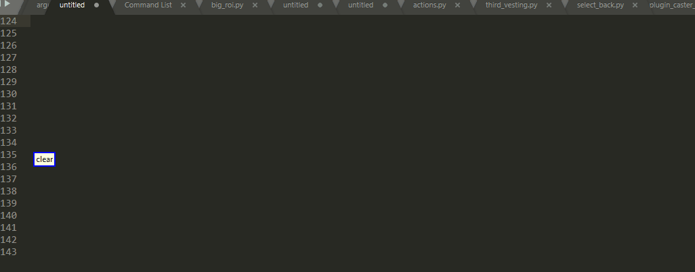
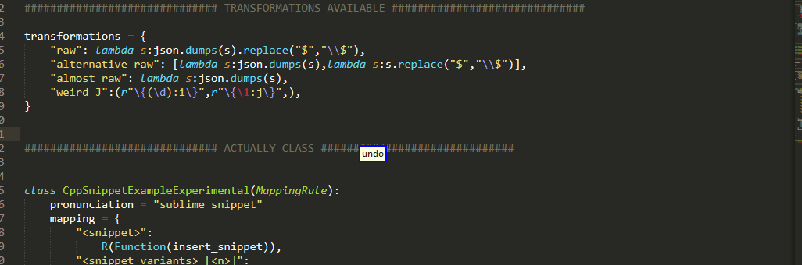

# CasterSublimeSnippetInterfaceExample

Repository for experimenting with sublime snippets and Caster voice commands 

## Contents
<!-- MarkdownTOC  autolink="true" -->

- [Introduction And Motivation](#introduction-and-motivation)
- [First Example](#first-example)
	- [Basic Usage](#basic-usage)
	- [Snippets With Variants Initial](#snippets-with-variants-initial)
- [Custom C++ Snippets](#custom-c-snippets)
	- [Snippets With Variants Improved](#snippets-with-variants-improved)
- [Experimental Features](#experimental-features)
	- [Applying Transformations To Snippets](#applying-transformations-to-snippets)
- [Snippets Generated From C++ STL](#snippets-generated-from-c-stl)

<!-- /MarkdownTOC -->

## Introduction And Motivation

When programming by voice, utilizing code snippets can have an important impact on improving your speed and making your overall experience more enjoyable! Nonetheless, creating such snippets can be time-consuming, because you need to create all the individual .sublime-snippet files containing the actual content of those snippets as well as the voice grammar containing commands to trigger them!

This is a proof of concept that lifts these restriction and which I hope will make your life easier by enabling you to do everything from only the grammar side!

None of the following, and I mean literally NONE (including the quick panel!), requires any additional code running on the sublime side and in fact not even a single .sublime-snippet file! Everything can be directly edited from within the grammar which uses the sublime command line interface `subl` to insert custom (possibly even dynamically generated) snippets!

But enough blah blah let's get going!

## First Example

Let's start with the [original example](./sublime_snippet_example.py) 

### Basic Usage

As they say, a gif is worth a thousand words



(please note that the file has been modified ever since these gif was recorded but you still get the point)


### Snippets With Variants Initial


I have also added some support for snippets with variants, so that you can use suffix integer

```python
"<snippet_variants> [<n>]"
```

To select which alternative from a list of variants of the same snippet you want! In case of error, you can use 

```python
"variant <n>"
```

To pick another variant and you can optionally display those alternatives on the quick panel by using

```python
"display variants"
```

To see that all in action




## Custom C++ Snippets

Inside [custom_cpp.py](./custom_cpp.py) you can find a whole bunch of custom snippets that I have created for my personal usage. You probably might want to change them to suit your needs but they could serve as a baseline, I really had a great time with some of them like `error line [<n>]`!


### Snippets With Variants Improved


## Experimental Features

Inside [custom_cpp_experimental.py](./custom_cpp_experimental.py) you will find more or less the same snippets but with a couple of more features

### Applying Transformations To Snippets





## Snippets Generated From C++ STL

